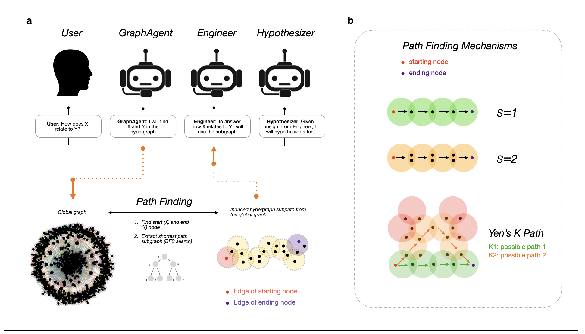

#### Isabella Stewart, Markus J. Buehler, MIT, 2025 
Corresponding author: mbuehler@MIT.EDU

#### LAMM, Massachusetts Institute of Technology


## Getting Started

1. Instantiate environment 
2. Install CUDA tooklit
3. Install llama-cpp-python
4. Install GraphReasoning package

## 1) Instantiate Environment Configuration:

```
conda create -n LLM_hypergraphreasoning python=3.11 -y
conda activate LLM_hypergraphreasoning
```

## 2) Install CUDA (Recommended via Conda) 

Note: Ensure that the NVIDIA CUDA driver is already installed on your system before proceeding.

```
conda install -c "nvidia/label/cuda-12.6.0" cuda-toolkit cuda-nvcc -y --copy
```

## 3) (Optional) Install llama-ccp-python
Required only if you intend to run models locally (≥ v0.2.0). 
You can skip this step if you’re using API-based LLMs.

```
CMAKE_ARGS="-DGGML_CUDA=on -DLLAVA_BUILD=on" FORCE_CMAKE=1 pip install git+https://github.com/abetlen/llama-cpp-python@v0.3.8 --verbose
```


## 4) Install HyperGraphReasoning package
Clone the repository and proceed with the direct installation.
```
git clone https://github.com/lamm-mit/HyperGraphReasoning.git
cd HyperGraphReasoning
pip install .
```

***



***
# Generating a Hypergraph

## PDF2Markdown
To convert PDF to markdown, follow instructions for creating environment at https://github.com/datalab-to/marker.git

```bash
conda activate marker
```

To convert multiple files at once: 
```bash
marker /path/to/input/folder
```
To convert multiple files on multiple GPUs: 
```bash
NUM_DEVICES=4 NUM_WORKERS=15 marker_chunk_convert ../pdf_in ../md_out
```
## Generating Hypergraph and Hypergraph Embeddings from Markdown Files

Convert the Jupyter notebook to a Python script:
```bash
jupyter nbconvert --to script make_hypergraph.ipynb
```
This will create 

```bash
make_hypergraph.py
```

Run the generated script: 
```bash
python make_hypergraph.py
```
(optional) Submit the job script (e.g., SLURM):

```bash
sbatch run_make_hypergraph.sh
```

'make_hypergraph.ipynb' includes code that  

***

## Run Hypergraph Agents 

Open and run the following notebook in **JupyterLab**:
```bash
Agents.ipynb
```
The agents use: 

Generated hypergraph (compatible with HYPERNETX) can be found in
`Notebooks/SG/GRAPHDATA_OUTPUT_paper/final_graph.pkl`

Generated hypergraph with all metadata can be found in
`Notebooks/SG/GRAPHDATA_OUTPUT_paper/updated_sub_dfs.pkl`

Generated hypergraph embeddings can be found in
`Notebooks/SG/GRAPHDATA_paper/composite_LLAMA4_70b.pkl`


'Agents.ipynb' stored in '/Notebooks/SG/Agents.ipynb' includes code for locally hosted LLM model 'meta-llama/Llama-3.3-70B-Instruct' as explained in our Methods, with our embedding model 'nomic-ai/nomic-embed-text-v1.5', loaded locally using the 'SentenceTransformers' library.

***

## Analyze Hypergraph

Open and run the following notebook in **JupyterLab**:
```bash
analyze_hypergraph.ipynb
```

The analysis uses: 
Generated hypergraph (compatible with HYPERNETX) can be found in
`Notebooks/SG/GRAPHDATA_OUTPUT_paper/final_graph.pkl`

***


## Citation

Please cite this work as:

```bibtex
@article{stewart2025hypergraphreasoning,
  title     = {HIGHER-ORDER KNOWLEDGE REPRESENTATIONS FOR AGENTIC
SCIENTIFIC REASONING},
  author    = {x},
  journal   = {x},
  year      = {2025},
  doi       = {x}
}
